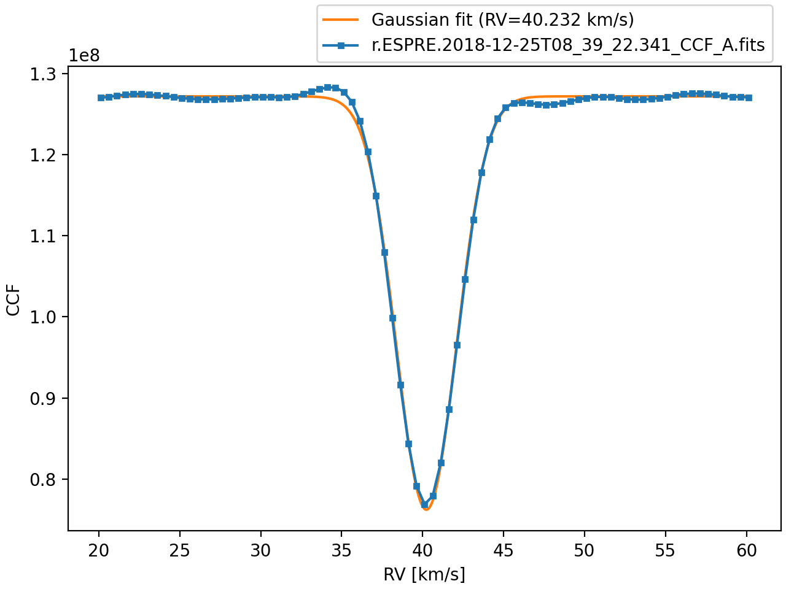
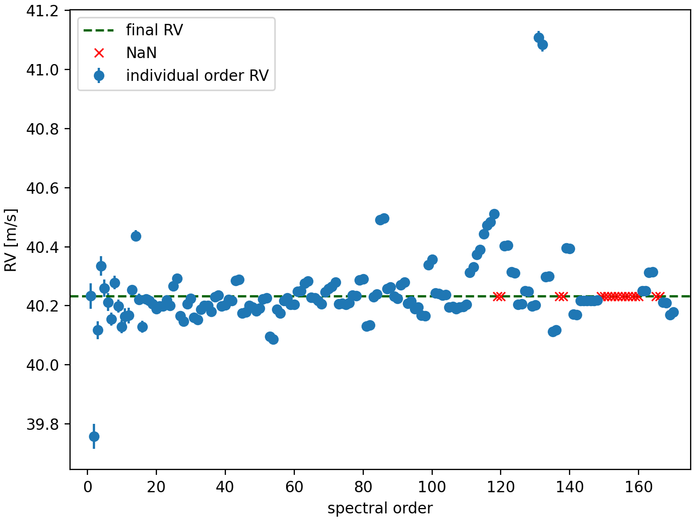
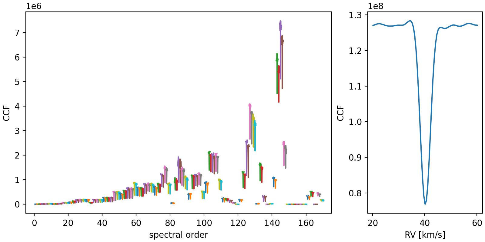

Most often, you will want to create an `Indicators` object from a CCF file:

```python
import iCCF

i = iCCF.from_file('r.ESPRE.YYYY-MM-DDTHH:MM:SS.SSS_CCF_A.fits')
# CCFindicators(CCF from r.ESPRE.YYYY-MM-DDTHH:MM:SS.SSS_CCF_A.fits)
```

It's useful to visualize the CCF as well:

```python
i.plot()
```




Then, the `i` object stores several CCF indicators as attributes.  
The radial velocity and uncertainty are stored in the `RV` and `RVerror`
attributes

```python
i.RV        # np.float32(40.23212)
i.RVerror   # np.float32(0.0002788162)
```


!!! info "Note"
    <br> In this example, both the radial velocity and the uncertainty are 32-bit
    floats. This is because the underlying CCF data was stored as 32-bit floats as
    well. **iCCF** takes great care to preserve the numerical precision in all
    calculations.


These values were calculated by fitting a Gaussian function to the CCF, in the
same way as done by the ESPRESSO pipeline. We also have access to the original
pipeline RV value that is stored in the header of the CCF file:

```python
i.pipeline_RV  # 40.2321199262624
```

!!! info "Note"
    <br> The pipeline value is stored in the header with full 64-bit precision!


### Order-by-order RVs and CCFs


The `i` object also stores the order-by-order CCFs, which allows to calculate
the individual RVs for each order. These can be conveniently accessed via the
`i.individual_RV` attribute and plotted with:

```python
i.plot_individual_RV()
```



!!! info "Note"
    <br> Some of the individual RVs are NaN because that order's CCF is equal to zero.


In fact, the order-by-order CCFs can also be visualised easily:

```python
i.plot_individual_CCFs()
```

