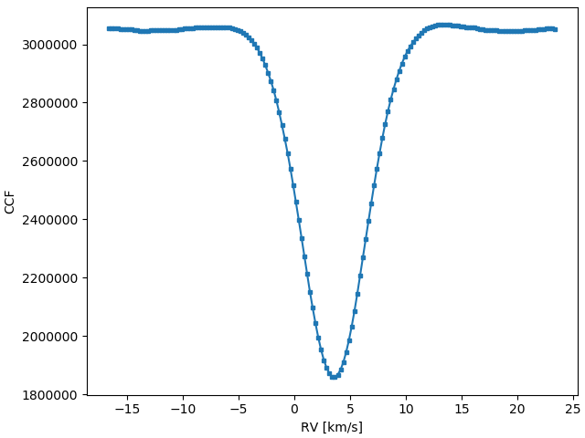

<h1>Welcome to <i>i</i>CCF's documentation</h1>

[](https://travis-ci.org/j-faria/iCCF)
[](https://opensource.org/licenses/MIT)
[](https://pypi.org/project/iCCF/)

This package provides clear and well-documented implementations of common  
line profile indicators measured from the cross-correlation function (CCF).  
And many other utility functions to work with CCFs.
{: .fs-5 .fw-300 }


<!-- When searching for exoplanets with the radial-velocity (RV) method, -->
<!-- these indicators are sometimes used as tracers of stellar activity. -->
<!-- {: .fs-5 .fw-300 } -->

[I'm sold, let's use it](#install){: .btn .btn-primary .fs-5 .mb-4 .mb-md-0 .mr-2 }
[GitHub repository](https://github.com/j-faria/iCCF){: .btn .fs-5 }


---

## Installation <a name="install"></a>

Using `pip`, installation is quite easy

```bash
pip install iCCF
```


You can also clone the GitHub repository and install it yourself

```bash
git clone https://github.com/j-faria/iCCF
cd iCCF
python setup.py install # (or better yet, develop)
```

If you experience any problems during installation,
[open an issue](https://github.com/j-faria/iCCF/issues) on GitHub.


## Getting started

If you want to read more about CCFs, go 
[here]({{ site.baseurl }}).  
The list and description of the indicators implemented in **iCCF** is
[here]({{ site.baseurl }}).


Let's start by using **iCCF** with the provided example data.

```python
import iCCF

rv, ccf = iCCF.utils.load_example_data()
```

This is a CCF calculated from a HARPS spectrum.
It looks like this




We can now load the arrays into an `Indicators` class

```python
i = iCCF.Indicators(rv, ccf)
```

and get the CCF indicators as attributes

```python
i.RV
i.FWHM
i.BIS
```

The same thing can be accomplished by reading from a CCF fits file

```python
i = iCCF.Indicators.from_file('CCF_file.fits')
```


----
## Cite

As of now, all the indicators implemented in **iCCF**
are based on the works of others.
Please cite the appropriate papers from the following list
if you use this package.

  - [Queloz et al 2001](https://doi.org/10.1051/0004-6361:20011308)
  - [Nardetto et al 2006](https://doi.org/10.1051/0004-6361:20054333)
  - [Boisse et al 2011](https://doi.org/10.1051/0004-6361/201014354)
  - [Figueira et al 2013](https://www.aanda.org/articles/aa/abs/2013/09/aa20779-12/aa20779-12.html)
  - [Santerne et al 2015](https://doi.org/10.1093/mnras/stv1080)
  - [Lanza et al 2018](https://doi.org/10.1051/0004-6361/201731010)
  

## See also

- Similar codes were developed by Figueira et al. A&A 557, A93 (2013)  
  with a Python package available [here](https://bitbucket.org/pedrofigueira/line-profile-indicators/src/master/)
  (described in Appendix A of Santos et al. A&A 566, A35 (2014))

- A similar package (in IDL) was developed by Lanza et al. A&A 616, A155 (2018).  
  It is available [here](https://www.ict.inaf.it/gitlab/antonino.lanza/HARPSN_spectral_line_profile_indicators).